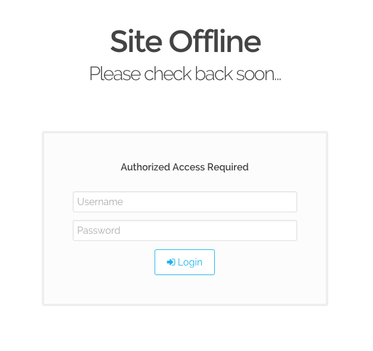

# Grav Maintenance Plugin



If you ever need to take your site offline temporarily or during development, you can use the [Grav](http://github.com/getgrav/grav) `maintenance` plugin to easily accomplish it..

This plugin works in concert with the `login` plugin which is required if you wish to have the ability to login while the site is in maintenance mode.

# Installation

Installing the Maintenance plugin can be done in one of two ways. Our GPM (Grav Package Manager) installation method enables you to quickly and easily install the plugin with a simple terminal command, while the manual method enables you to do so via a zip file. 

## GPM Installation (Preferred)

The simplest way to install this plugin is via the [Grav Package Manager (GPM)](http://learn.getgrav.org/advanced/grav-gpm) through your system's Terminal (also called the command line).  From the root of your Grav install type:

    bin/gpm install maintenance

This will install the Maintenance plugin into your `/user/plugins` directory within Grav. Its files can be found under `/your/site/grav/user/plugins/maintenance`.

## Manual Installation

To install this plugin, just download the zip version of this repository and unzip it under `/your/site/grav/user/plugins`. Then, rename the folder to `maintenance`. You can find these files either on [GitHub](https://github.com/getgrav/grav-plugin-maintenance) or via [GetGrav.org](http://getgrav.org/downloads/plugins#extras).

You should now have all the plugin files under

    /your/site/grav/user/plugins/maintenance

> NOTE: This plugin is a modular component for Grav which requires [Grav](http://github.com/getgrav/grav), the [Problems](https://github.com/getgrav/grav-plugin-problems) plugin, and a theme to be installed in order to operate.

# Usage

The default configuration provided in the `user/plugins/maintenance.yaml` file contains sensible defaults:

```
enabled: true
active: false
allow_login: true
login_access: 'site.login'
maintenance_page_route:
```

To make your own modifications to the configuration options, you should copy the `user/plugins/maintenance/maintenance.yaml` file into a file: `user/config/plugins/maintenance.yaml`.  Then if you wish to modify a particular setting you should copy the whole node and modify it, for example:

```
active: true
```

Alternatively you can administrate the plugin via the [Grav Admin plugin](https://github.com/getgrav/grav-plugin-admin) by clicking on **plugins**, and then on **maintenance**.

# User Login Access

If you enable the `allow_login` option (default is enabled), Your offline maintenance page will consist of a message plus a login box to allow authorized users to authenticate.  The default setting for the access is `site.login`.  

This means that for a user to be able to login to the front end when in maintenance mode, you need to first create a user that has this access.  

This can be achieved easily with the `bin/grav newuser` command.  Just fill in appropriate values when prompted, and ensure you pick **site access** or **admin and site access** as this will provide the required `site.login: true` setting the user will need.  Of course you can change the access to whatever you wish, so perhaps you want to have a specific `site.maintenance` access setting, you would need to manually add this to the list of user access in the user account YAML.

# Usage

By default, the `Maintenance` plugin is enabled but is **not active** that means it's ready to go.

To switch into maintenance mode, simply toggle the `active` setting in plugin configuraiton.

Something you might want to do is to override the look and feel of the Maintenance page, and with Grav it is super easy.

### Template

The plugin comes with a simple `maintenance.html.twig` file for rendering the offline page.  This assumes your theme has a `partials/base.html.twig`.  If your theme does not have this, or if you wish to modify the look and feel of the page, you can copy the template file [templates/maintenance.html.twig](templates/maintenance.html.twig) from the plugin directory, into the `templates` folder of your custom theme. Make any modifications required.

```
/your/site/grav/user/themes/custom-theme/templates/maintenance.html.twig
```

You can now edit the override and tweak it however you prefer.

### Page

The plugin also comes with a simple page file located in [pages/maintenance.md](pages/maintenance.md). If you wish to customize the content of this page, you can simply copy it into a new folder in your `pages` folder of your Grav user directory and modify it as required.

```
/your/site/grav/user/pages/maintenance/maintenance.md
```

After this you need to tell the plugin where to look for this custom page, and this can be done by setting the `maintenance_page_route` setting in the plugin configuration.

> Note: This should be a valid Grav route, for example: `/system/maintenance'

# Updating

As development for the Maintenance plugin continues, new versions may become available that add additional features and functionality, improve compatibility with newer Grav releases, and generally provide a better user experience. Updating Maintenance is easy, and can be done through Grav's GPM system, as well as manually.

## GPM Update (Preferred)

The simplest way to update this plugin is via the [Grav Package Manager (GPM)](http://learn.getgrav.org/advanced/grav-gpm). You can do this with this by navigating to the root directory of your Grav install using your system's Terminal (also called command line) and typing the following:

    bin/gpm update maintenance

This command will check your Grav install to see if your Maintenance plugin is due for an update. If a newer release is found, you will be asked whether or not you wish to update. To continue, type `y` and hit enter. The plugin will automatically update and clear Grav's cache.

> Note: Any changes you have made to any of the files listed under this directory will also be removed and replaced by the new set. Any files located elsewhere (for example a YAML settings file placed in `user/config/plugins`) will remain intact.
